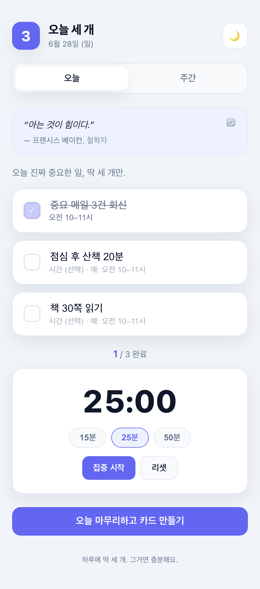
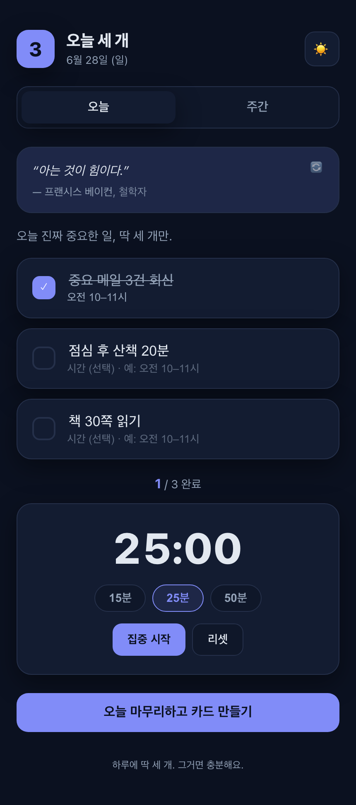
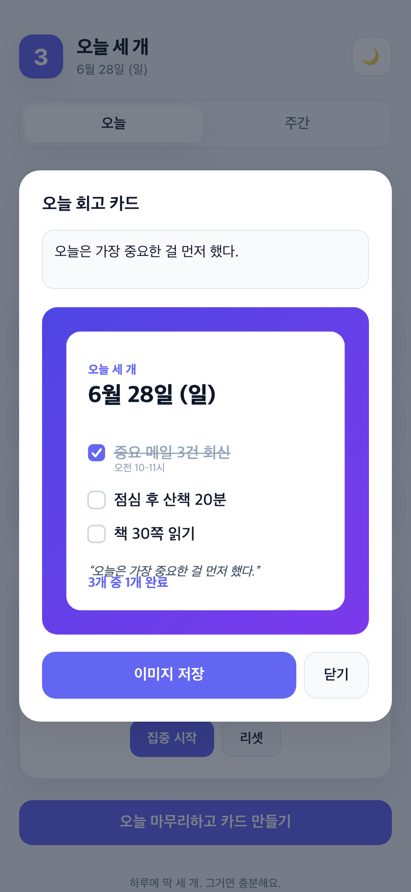
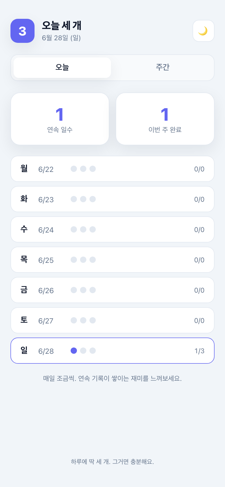

# 오늘 세 개 (today-three)

오늘 진짜 중요한 일 **딱 3개**에만 집중하는 웹 플래너. 할 일 목록에 파묻히는 대신, 하루를 세 가지로 좁히고 끝나면 회고 카드로 공유한다.

별도 서버나 백엔드 없이 브라우저에서 완결되는 **100% 클라이언트 사이드 앱**이다. 정적 호스팅에 그대로 배포된다.

## 미리보기

| 오늘 (라이트) | 오늘 (다크) |
|:---:|:---:|
|  |  |
| **회고 카드 (공유 이미지)** | **주간 리뷰** |
|  |  |

## 실행 / 빌드

```bash
npm install
npm run dev        # 개발 서버 (http://localhost:5173)
npm run build      # 정적 빌드 → dist/
npm run preview    # 빌드 결과 미리보기
npm run type-check # vue-tsc 타입 검사
npm test           # Vitest 단위·컴포넌트 테스트
npm run coverage   # 커버리지 리포트
```

배포: `dist/`를 Cloudflare Pages / Vercel / GitHub Pages 등 정적 호스팅에 올리면 끝.

## 기술 스택

- Vue 3 (`<script setup>`) + Vite + TypeScript
- **Pinia** 상태관리 — setup-store 문법(`src/stores/`). 상태/getter/action을 composable처럼 작성.
- @vueuse/core (`useStorage` 로컬 저장, `useIntervalFn` 타이머, `usePreferredDark`)
- **Vitest** + @vue/test-utils + happy-dom — 스토어 단위 테스트 + 컴포넌트 테스트
- 스타일: CSS 변수 기반 테마(`src/style.css`), 외부 UI 라이브러리 없음
- 공유 카드: Canvas API 직접 렌더(`src/lib/shareCard.ts`)

## 구조

```
src/
  main.ts                 진입점 + 프로덕션 서비스워커 등록
  App.vue                 레이아웃 / 헤더 / 탭(오늘·주간)
  style.css               전역 스타일 + 테마 변수
  components/
    TodayBoard.vue        오늘의 3개 + 진행 + 타이머 + 마무리 버튼
    QuoteCard.vue         오늘의 명언(로딩/에러/재시도 UI)
    QuoteCard.test.ts     컴포넌트 테스트(fetch 모킹: 성공/에러/재시도)
    FocusTimer.vue        집중 타이머
    ReviewCard.vue        회고 카드 미리보기 / 저장 / 공유 모달
    WeeklyReview.vue      최근 7일 + streak
  stores/                 Pinia 스토어 (+ 각 *.test.ts)
    days.ts               날짜별 할 일 데이터 모델 + localStorage 영속
    quote.ts              외부 명언 API 비동기 호출(fetch + 로딩/에러/타임아웃/하루 캐시)
    timer.ts              집중 타이머
    theme.ts              라이트/다크 테마
  lib/
    date.ts               날짜 키/표시 유틸 (+ date.test.ts)
    shareCard.ts          공유용 카드 이미지(Canvas)
public/
  manifest.webmanifest    PWA 매니페스트
  sw.js                   최소 서비스워커(앱 셸 캐시)
  icon.svg                앱 아이콘
```
